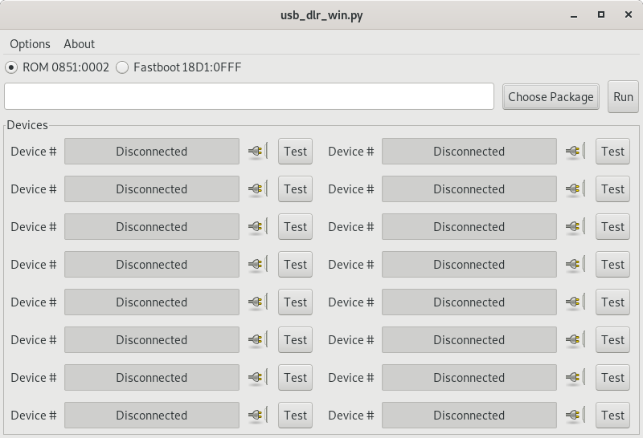

# usb-img-dl
USB Firmware download tool for Infomax's Android EVB board written in python.  
* PyGtk is used for the GUI.
* Both Linux and Windows platform are supported.

# Setup
* `apt install python-gtk2 python2-dev`
* `pip install pyusb progress`

# Screenshot

